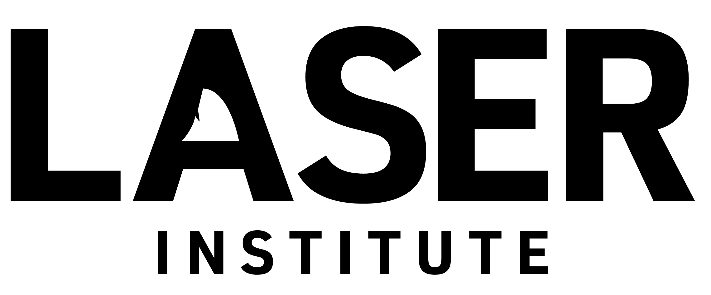

A LASER Focus on Understanding and Improving STEM Education

​**Date/Time: Wednesday, August 11, 2021; 1:00pm–4:00pm**

### Overview

This workshop will introduce participants to the Learning Analytics (LA), an emerging research and teaching field sitting at the intersection of Learning (e.g. educational technology, learning and assessment sciences), Analytics (e.g. visualization, computer/data sciences), and Human-Centered Design (e.g. usability, participatory design). LA is proving to be a powerful approach for understanding and improving the digital learning contexts highlighted in the national STEM education plan, while also examining persistent problems in STEM education from new angles.

The instructors will provide a brief overview of LA methodologies, literature, applications, and ethical issues as they relate to STEM education, with an emphasis on digital learning environments and broadening participation in STEM programs. Participants will be introduced to open-access curriculum materials developed as part of the [Learning Analytics in STEM Education Research (LASER) Institute](https://www.fi.ncsu.edu/projects/laser-institute/) to gain hands-on experience with computational analysis techniques (e.g. network analysis, text mining, machine learning) using R and RStudio.

### **Instructors:**

-   Shaun B. Kellogg, North Carolina State University​

-   Shiyan Jiang, North Carolina State University

-   ​Rob Moore, University of Florida 

-   Joshua M. Rosenberg, University of Tennessee, Knoxville

### Schedule

**1:00-1:30.** Overview of Learning Analytics in STEM Ed Research (LASER)

-   The

**1:30-1:40.** [RStudio Cloud Setup](https://rstudio.cloud/spaces/159154/join?access_code=MlqXbTuL20QPR7GVmyyKDkuWwqUvhRcmVFvRRZuz)

**1:40-2:20.** Intro to Text Mining (TM) in STEM

-   **Intro to TM in STEM** includes a short [presentation](https://laser-institute.github.io/aera-workshop/slides/text-mining-intro.html) and [demonstration](https://laser-institute.github.io/aera-workshop/pages/text-mining-demo.html) from [Text Mining (TM) Module 1: Public Sentiment and the State Standards](https://github.com/laser-institute/text-mining) taught at the LASER Institute Summer Workshop. This component will help illustrate how text mining can be applied in STEM education research and provide workshop participants hands-on experience with popular techniques for collecting, processing, and analyzing text-based data.

**2:20-2:30.** Q&A/Break

**2:30-3:10.** Intro to **Machine Learning** in STEM

-   

**3:10-3:20.** Q&A/Break

**3:20-4:00.** Intro to **Social Network Analysis** in STEM

-   

### Acknowledgements

This workshop is part of the [**AERA-ICPSR Partnership for Expanding Education Research in STEM (PEERS) Data Hub**](https://www.icpsr.umich.edu/web/pages/peersdatahub/) announces the **PEERS Research Methods Series** a webinar series of research capacity-building workshops that focus on research methods used in STEM education research. 

The **PEERS Research Methods Series** consists of workshops presented in collaboration with the 11 Institutes in Research Methods funded by the National Science Foundation  directed to NSF's Building Capacity for STEM Education Research (BCSER) program. Aimed at early- and mid-career researchers and scholars, the capacity-building webinar series features projects that seek to promote research expertise in applications of computational, quantitative, qualitative, and evaluative research methods useful to STEM education researchers and broaden the STEM professional workforce.

### The LASER Team

[**Shaun Kellogg**](https://www.fi.ncsu.edu/people/sbkellog/) is Senior Director of the Friday Institute's Program Evaluation and Education Research (PEER) Group and Teaching Assistant Professor in the College of Education at North Carolina State. Dr. Shaun Kellogg has over 20 years of experience in education as both a public school teacher and educational researcher. Since 2011, Dr. Kellogg has led comprehensive research, evaluation, and capacity-building projects centered on the use of technology to make learning more equitable, engaging, and effective for students and educators. He recently developed the Online Graduate Certificate in Learning Analytics in partnership with the College of Education and serves as the Principal Investigator on the NSF-funded Learning Analytics in STEM Education Research (LASER) Institute.

[**Shiyan Jiang**](https://ced.ncsu.edu/people/shiyan-jiang/) received her Ph.D. in technology-enhanced STEM education from the University of Miami in 2018. She was a postdoc at Carnegie Mellon University and worked in designing an innovative writing feedback system. Currently, she is an assistant professor of Learning Design and Technology at North Carolina State University. She designs and studies technology-enhanced learning environments to facilitate the development of STEM identities.

[**Joshua M. Rosenberg**](https://tpte.utk.edu/people/joshua-rosenberg-phd/) (PhD, Michigan State University) is an assistant professor of STEM education and faculty fellow at the Center for Enhancing Education in Mathematics and Sciences at the University of Tennessee, Knoxville. His research focuses on how learners think of and with data, particularly in science education settings. Professor Rosenberg tries to understand how practices such as creating, representing, and modeling data create new opportunities for learning how to use data to pose and answer questions about scientific phenomena. Professor Rosenberg has been awarded more than three million dollars in federal grants as principal investigator (PI) or co-PI and has published in outlets such as Journal of Research in Science Teaching, Computers & Education, and Teaching and Teacher Education.

Dr. Shiyan Jiang is

### The 2021 LASER Scholars

-   Mete Akcaoglu, Associate Professor, *Georgia Southern Universit*y

-   Zina Alaswad, Assistant Professor of Interior Design, School of Family and Consumer Sciences, *Texas State University* 

-   Tawannah G. Allen, Associate Professor of Educational Leadership, Stout School of Education, *High Point University*

-   Rebecca Y. Bayeck, CLIR Postdoctoral Fellow, *Schomburg Center for Research in Black Culture*

-   Laurie O. Campbell, Associate Professor, *University of Central Florida*

-   Jacqueline G. Cavazos, Postdoctoral Scholar, *University of California Irvine*

-   Shonn Sheng-Lun Cheng, Assistant Professor, *Sam Houston State University*

-   MeganClaire Cogliano, Postdoctoral Fellow, *University of Nevada, Las Vegas*

-   Yvonne Earnshaw, Assistant Professor and Program Coordinator of Instructional Design and Development, *University of Alabama at Birmingham*

-   Carlton J. Fong, Assistant Professor, *Texas State University*

-   Hoda Harti, Instructor, Educational Technology, *Northern Arizona University*

-   Yu-Ping Hsu, Assistant Professor, *Western Illinois University*

-   Diane Igoche, Associate Professor, *Robert Morris University*

-   Carrie Jones, Science Teacher, *Wake County Schools*

-   Yeo-eun Kim, Postdoctoral Fellow, *Washington University in St. Louis*

-   TK Kuykendall, Adjunct/Coordinator of Data, *Cleveland State University/Lakewood City Schools*

-   Yanju Li, Data Administrator Lead, *Georgia State University*

-   Lin Lin, Professor, *University of North Texas*

-   Peggy Lisenbee, Associate Professor of Early Childhood Education, College of Professional Education, *Texas Woman's University*

-   Nikki G. Lobczowski, Postdoctoral Associate, *University of Pittsburgh*

-   Chrishele Marshall, Program Associate I, Implementation and Training (Assessment), *Detroit Public Schools Community District*

-   Tara Mason, Assistant Professor of Inclusive Education, *Western Colorado University*

-   Becky Matz, Research Scientist, Center for Academic Innovation, *University of Michigan*

-   T.J. McKenna, Lecturer, *Boston University*

-   Vida Mingo, Senior Lecturer, *Columbia College (SC*)

-   Angela Murillo, Assistant Professor, School of Informatics and Computing, *Indiana University-Purdue University Indianapolis*

-   Jeffrey T. Olimpo, Assistant Professor in Biological Sciences, *The University of Texas at El Paso*

-   Patricia Ortega-Chasi, Associate Professor, *Universidad del Azuay*

-   Mihwa Park, Assistant Professor, *Texas Tech University*

-   Kim Pinckney-Lewis, HR Strategist, *National Security Agency*

-   Tiffany Roman, Assistant Professor of Instructional Technology, School of Instructional Technology and Innovation, *Kennesaw State University*

-   Teomara (Teya) Rutherford, Assistant Professor, Learning Sciences, *University of Delaware*

-   Jaime Sabel, Assistant Professor, *University of Memphis*

-   Samar Swaid, Professor of Computer Science, *Philander Smith College*

-   Justice T. Walker, Assistant Professor of STEM Education, *The University of Texas at El Paso*
