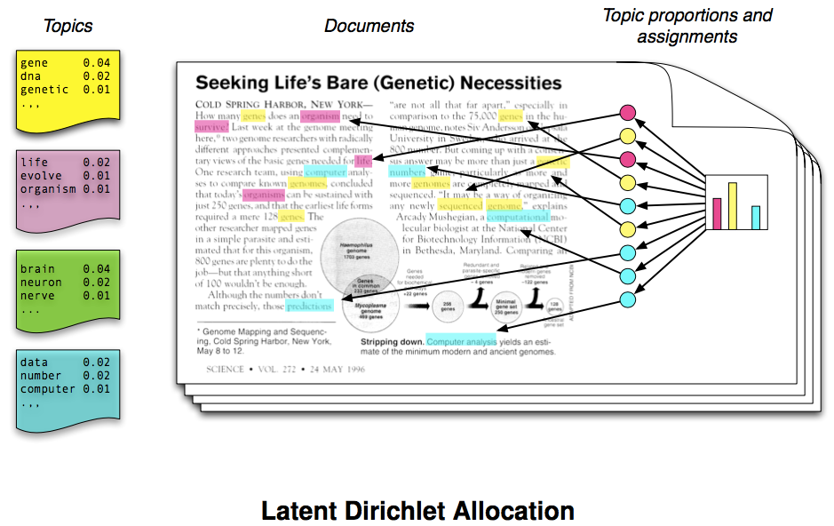

# Overview

1. Why machine learning and **what is it** exactly?

1. How is machine learning used in **STEM education** research? 

1. What are some of the **technical and ethical** considerations? 

---
class: inverse, center, middle

# 1. Why machine learning and what is it?

---
# Why machine learning? 

Researchers are using ML to unlock new discoveries and insights about teaching and learning with various types of data.


---

# What is machine learning?

.pull-left[
- Large dataset
- Informative feature
- Pattern
- Prediction]

.pull-right[]

---

class: center, middle

<font size="30">Machine learning is about automatically finding meaningful patterns in data</font>

---

class: inverse, center, middle

# 2. What are common techniques used for quantifying text? 


---

# Basic Text Analysis


.pull-left[
... it’s a mistake to imagine that text mining is now in a sort of crude infancy, whose real possibilities will only be revealed after NLP matures. **Wordcounts are amazing!**

- Text Preprocessing
- Word Counts
- Term Frequencies
- TF-IDF
]

.pull-right[
Yep. A Word Cloud.

]

.footnote[
Underwood, T. (2013). [Wordcounts are amazing](https://tedunderwood.com/2013/02/20/wordcounts-are-amazing/). The Stone and the Shell.
]

---

# Dictionary-Based Methods

.pull-left[
Dictionary-based text analysis uses predefined list of words, or **lexicons**, to assign a particular meaning, value, or category to each word in you data:  

- Custom Dictionaries
- Stop Words
- Sentiment Lexicons
- Linguistic Inquiry Word Count (LIWC)
]
.pull-right[
Bing Lexicon Example: 
```{r, echo=F, message=FALSE}
library(tidytext)
library(dplyr)
library(DT)
knitr::kable(sample_n(get_sentiments("bing"), 5))
```
]

.footnote[
Bail, C. (2019). [Dictionary-Based Text Analysis in R](https://cbail.github.io/textasdata/dictionary-methods/rmarkdown/Dictionary-Based_Text_Analysis.html). Text as Data.
]

---

# Topic Modeling

With a bit of tongue-in-cheek, [Meeks and Weingart](http://journalofdigitalhumanities.org/2-1/dh-contribution-to-topic-modeling/) describe topic modeling as:

>leveraging occult statistical methods like 'dirichlet priors' and 'bayesian models'... to provide seductive but obscure results in the form of easily interpreted (and manipulated) 'topics.'

```{r, echo=F, out.width='55%', fig.align='center'}

```

.footnote[
Vayansky, I., & Kumar, S. A. (2020). [A review of topic modeling methods.](https://www.sciencedirect.com/science/article/pii/S0306437920300703?casa_token=o9sh0a7PIesAAAAA:_6LdKTPZL8OB8kQpuz9J2zd25PMkQQzZRBpdjREcCjADeUVgRUXVNBsUKYz1xNHetj9sEOH_VA) Information Systems, 94, 101582.
]


---
class: inverse, center, middle

# 3. What are some of the technical and ethical considerations of text mining? 

---
#  Text Mining Considerations

Despite the potential advantages of text-based data captured by educational technologies, **TM poses a number of challenges** for STEM Ed researchers. 


.footnote[
Bail, C. (2019). [Strengths and weaknesses of digital trace data ](https://sicss.io/2020/materials/day2-digital-trace-data/strengths-weaknesses/rmarkdown/Strengths_and_Weaknesses.html#weaknesses-of-digital-trace-data). Text as Data.
]

--

.pull-left[
Logistical & Technical
- Unstructured
- Inaccessible
- Non-Representative
- Incomplete
]

--

.pull-right[
Ethical & Legal
- Bias (algorithmic, positivity)
- Sensitive
- Terms of Use
- FERPA

]


---
class: inverse, center, middle

```{r xaringan-panelset, echo=FALSE}
xaringanExtra::use_panelset()
```

# 4. How is text mining used in STEM education research?

---
# Applications in STEM Ed Research

.panelset[

.panel[.panel-name[Performance]
TM has been largely used to **evaluate academic  performance** in different contexts, especially to  essays and online assignments.

- writing style
- use of argumentation
- plagiarism detection
- peer interaction
]

.panel[.panel-name[Feedback]
To help improve performance, TM is used to  **provide student feedback**, often based on both their interactions and activities 

- Intelligent Tutoring Systems
- Question-answering applications
- Assist teacher  feedback
- Support formative feedback

]

.panel[.panel-name[Engagement]
TM has been applied to **support student engagement and collaboration**, especially in distance learning courses. 

- Automated writing scaffolds
- Analysis of interactional resources
- Student sentiment extraction
- Dropout prevention
]

.panel[.panel-name[Other Uses]
Other applications of text mining in STEM Ed Research include: 
- Automatic text summarization
- Analytics & visualization tools
- Curriculum adaptation
- Recommendation systems
]


]

.footnote[
Ferreira‐Mello, R., André, M., Pinheiro, A., Costa, E., & Romero, C. (2019). [Text mining in education.](https://wires.onlinelibrary.wiley.com/doi/full/10.1002/widm.1332?casa_token=lZT4D6PBOnIAAAAA%3AgL-AaN62g7YuQNyI5PIt6uguw7x2qnpFt8U_fkyM4ipRXUa6JzqcDH72dNU_8R21a_Abi4fNSucZWg) Wiley Interdisciplinary Reviews: Data Mining and Knowledge Discovery, 9(6), e1332.
]

---
class: inverse, center, middle

#Learning Lab Demo

