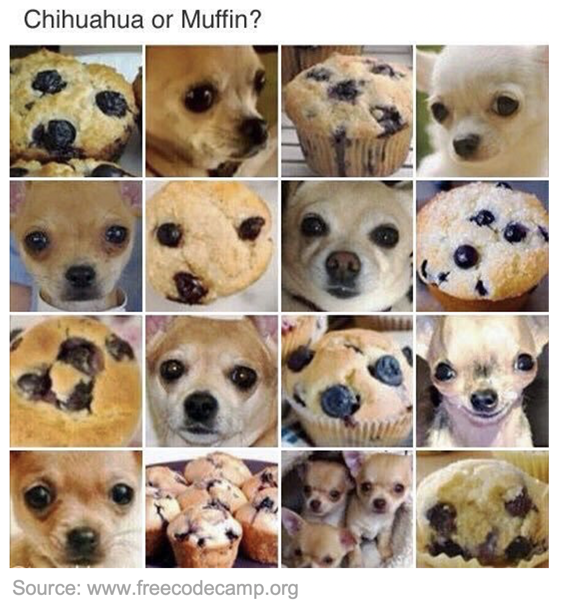
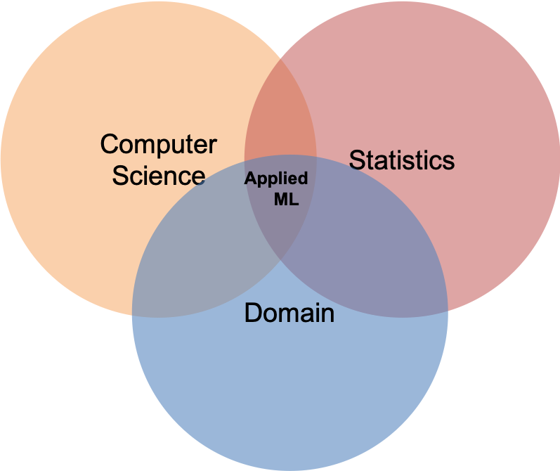
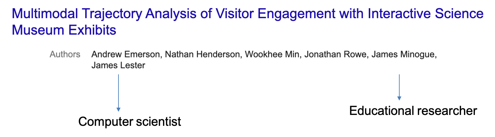
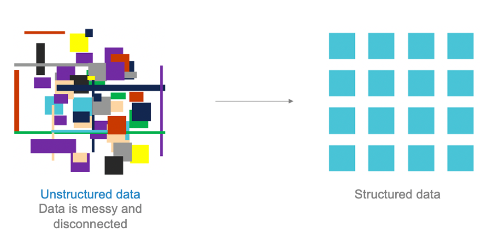

class: clear, title-slide, inverse, center, top, middle

# `r rmarkdown::metadata$title`
## `r rmarkdown::metadata$subtitle`
### `r rmarkdown::metadata$author`
###  2021/08/11 (updated: `r Sys.Date()`)

---

# What is Machine Learning?

.pull-left[
.font140[
 
+ Large dataset

+ **Informative feature**

+ Pattern

+ Prediction
]]

.pull-right[

]

---
class: clear, inverse, center, middle

# Machine Learning is about automatically finding meaningful patterns in data

---
class: clear, middle

.pull-left[
   
.font150[**Interdisciplinarity**]
]
.pull-right[

]

---
# Interdisciplinarity

   

---
# Outline
 
.font140[
+ Overview

+ Affordances

+ Limitations 
]

---
# Overview: Literature Review

.font130[
+ Journal of Science Education and Technology [Special Issue](https://link.springer.com/journal/10956/volumes-and-issues/30-2) (2021) Applying ML in Science Assessment

+ Alonso-Fernández et al. (2019) reviewed the literature for applications to game learning analytics (GLA) data

+ Luan & Tsai (2021) reviewed the literature for applications of ML for precision education

+ Bergner & von Davier (2019) reviewed NAEP’s use of learning process data
]
---
# Overview: ML Techniques
.font130[
- Unsupervised learning:
 - Augmented Reality in Science Laboratories: Investigating High School Students’ .orange[**Navigation Patterns**] and Their Effects on Learning Performance (Jiang et al., 2021)

- Supervised learning: 
 - Predicting .orange[**STEM and Non-STEM College Major Enrollment**] from Middle School Interaction with Mathematics Educational Software (San Pedro et al., 2014)
]
---
# Overview: ML for K-12

.pull-left[ .font90[ Project StoryQ]]
---
# Affordances of Machine Learning
 
.font140[
- **Students:** e.g., customizable experiences

- **Teachers:** e.g., automated scoring

- **Researchers:** e.g., analyze patterns in data
]
---
# Limitations of Machine Learning
 
.font140[
- Ethical considerations

- Deterministic problems

- Lack of (good) data

- Interpretability 

- Learning in context
]

---
class: clear, inverse, center, middle

.font140[Machine Learning is a current hot topic and continues to grow in popularity based on its applications]

