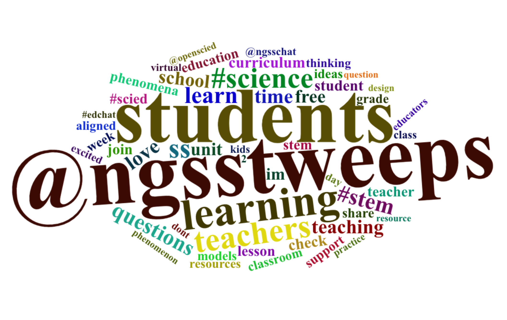

```{r}
library(tidytext)
library(dplyr)
library(DT)
```

---
# Overview

--
1. Why text mining and **what is it** exactly?

--
1. What are **common techniques** used for mining text? 

--
1. How is text mining **used in education** research? 

--
1. What are some of the **challenges and ethical considerations**? 

--
1. Can you give me **an example** in STEM Ed Research?

---
class: inverse, center, middle

# Why text mining and **what is it** exactly?

---
# Why should I care? 

The there has been **unprecedented increase in text-based digital data ** generated by educational processes and systems, resulting in... 


.footnote[
Okoye, K., Arrona-Palacios, A., Camacho-Zuñiga, C., Hammout, N., Nakamura, E. L., Escamilla, J., & Hosseini, S. (2020). [Impact of students evaluation of teaching: a text analysis of the teachers qualities by gender.](https://educationaltechnologyjournal.springeropen.com/articles/10.1186/s41239-020-00224-z) International Journal of Educational Technology in Higher Education, 17(1), 1-27.
]

--

.pull-left[
New **sources** of data
- Discussion Forums
- Online Assignments
- Instant Messaging Tools
- Social Media
- Etc. 
]

--

.pull-right[
New **features** of data
- Massive
- Always On
- Non-reactive
- Social relations  

]

---
class: center, middle

A central question in text mining is: 

# How do we **quantify** what a document is about?

.footnote[
Silge, J., & Robinson, D. (2017). [Text mining with R: A tidy approach.](https://www.tidytextmining.com) " O'Reilly Media, Inc.".]

---

# What is text mining? 

According to my graduate students... 

--

.pull-left[
Text mining **is**... 
- processes for gaining insight into large amounts of text
- an exploration of text in search of patterns 
- a form of computer-assisted reading
- magic
]

--

.pull-right[
Text mining **is not**... 
- a substitute for traditional qualitative analysis
- as "automated" as one would think
- unlike reading tea leaves
- magic

]

---
class: inverse, center, middle

# What are **common techniques** used for mining text? 


---

# Basic Text Analysis


.pull-left[
... it’s a mistake to imagine that text mining is now in a sort of crude infancy, whose real possibilities will only be revealed after NLP matures. **Wordcounts are amazing!**

- Text Preprocessing
- Word Counts
- Term Frequencies
- TF-IDF
]

.pull-right[
Yep. A Word Cloud.

]

.footnote[
Underwood, T. (2013). [Wordcounts are amazing](https://tedunderwood.com/2013/02/20/wordcounts-are-amazing/). The Stone and the Shell.
]

---

# Dictionary-Based Methods

.pull-left[
Dictionary-based text analysis uses predefined list of words, or **lexicons**, to assign a particular meaning, value, or category to each word in you data:  

- Custom Dictionaries
- Stop Words
- Sentiment Lexicons
- Linguistic Inquiry Word Count (LIWC)
]
.pull-right[
Bing Lexicon Example: 
```{r, echo=F}
knitr::kable(sample_n(get_sentiments("bing"), 5))
```
]

.footnote[
Bail, C. (2019). [Dictionary-Based Text Analysis in R](https://cbail.github.io/textasdata/dictionary-methods/rmarkdown/Dictionary-Based_Text_Analysis.html). Text as Data.
]

---


# Topic Modeling

.pull-left[
Dictionary-based text analysis uses predefined list of words, or **lexicons**, to assign a particular meaning, value, or category to each word in you data:  

- Custom Dictionaries
- Stop Words
- Sentiment Lexicons
- Linguistic Inquiry Word Count (LIWC)
]
.pull-right[
Bing Lexicon Example: 
```{r, echo=F}
knitr::kable(sample_n(get_sentiments("bing"), 5))
```
]

.footnote[
Bail, C. (2019). [Dictionary-Based Text Analysis in R](https://cbail.github.io/textasdata/dictionary-methods/rmarkdown/Dictionary-Based_Text_Analysis.html). Text as Data.
]


---
class: inverse, center, middle

# How is text mining **used in education** research?


---

