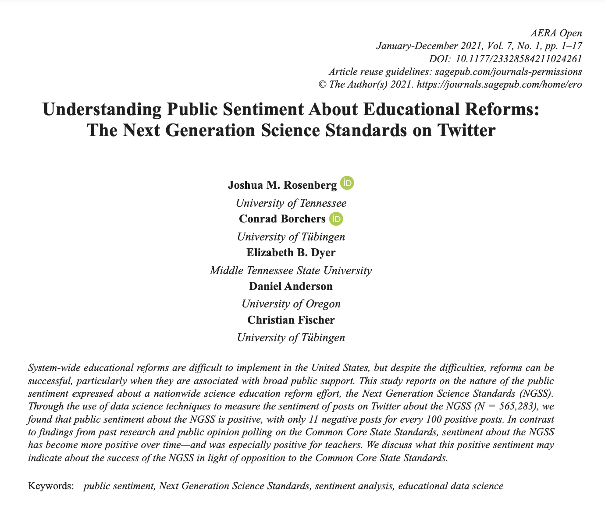

```{r setup, include=FALSE}
knitr::opts_chunk$set(echo = TRUE)
```

## 1. PREPARE

The transition to digital learning has made available new sources of data, providing researchers new opportunities for understanding and improving STEM learning. Data sources such as digital learning environments and administrative data systems, as well as data produced by social media websites and the mass digitization of academic and practitioner publications, hold enormous potential to address a range of pressing problems in STEM Education, but collecting and analyzing text-based data also presents unique challenges.

**Text Mining (TM) Module 1: Public Sentiment and the State Standards** will help demonstrate how text mining can be applied in STEM education research and provide LASER Institute scholars hands-on experience with popular techniques for collecting, processing, and analyzing text-based data. Specifically, the four learning labs that make up this module address the following topics:

-   **Learning Lab 1: Tidy Text, Tokens, & Twitter.** We take a closer look at the literature guiding our analysis; wrangle our data into a one-token-per-row tidy text format; and use simple word counts to explore our tweets about the common core and next generation science standards.

-   **Learning Lab 2: Come to the Dark Side.** We focus on the use of lexicons in our third lab and introduce the {vader} package to compare the sentiment of tweets about the NGSS and CCSS state standards in order to better understand public reaction to these two curriculum reform efforts. 

-   **Learning Lab 3: A Tale of Two Standards.** We wrap our look at public sentiment around STEM state curriculum standards by selecting an analysis that provides some unique insight; refining and polishing a data product; and writing a brief narrative to communicate findings in response to our research questions.

-   **Learning Lab 4: rTweet & the Twitter API (Optional).** This supplemental learning lab will get you up and running with the Twitter API in case you are interested in using data from Twitter in your own research. This lab can only be completed by those who created a Twitter Developer account.

### 1a. Review the Literature

Text Mining Module 1 is guided by a recent publication by *Understanding Public Sentiment About Educational Reforms: The Next Generation Science Standards on Twitter* [@rosenberg2021]. This study in turn builds on upon previous work by @wang2017 examining public opinion on the Common Core State Standards (CCSS) on Twitter. For Module 1, we will focus on analyzing tweets about the [Next Generation Science Standards](https://www.nextgenscience.org) (NGSS) and [Common Core State Standards](http://www.corestandards.org) (CCSS) in order to better understand key words and phrases that emerge, as well as public sentiment towards these two curriculum reform efforts.

#### Twitter and the Next Generation Science Standards

[{width="310"}](https://doi.org/10.1177/23328584211024261)

[Full Paper (AERA Open)](https://journals.sagepub.com/doi/full/10.1177/23328584211024261)

##### Abstract

System-wide educational reforms are difficult to implement in the United States, but despite the difficulties, reforms can be successful, particularly when they are associated with broad public support. This study reports on the nature of the public sentiment expressed about a nationwide science education reform effort, the Next Generation Science Standards (NGSS). Through the use of data science techniques to measure the sentiment of posts on Twitter about the NGSS (*N* = 565,283), we found that public sentiment about the NGSS is positive, with only 11 negative posts for every 100 positive posts. In contrast to findings from past research and public opinion polling on the Common Core State Standards, sentiment about the NGSS has become more positive over time---and was especially positive for teachers. We discuss what this positive sentiment may indicate about the success of the NGSS in light of opposition to the Common Core State Standards.

##### Data Sources

Similar to what we'll be learning in this lab, Rosenberg et al. used publicly accessible data from Twitter collected using the Full-Archive Twitter API and the `rtweet` package in R. Specifically, the authors accessed tweets and user information from the hashtag-based \#NGSSchat online community, all tweets that included any of the following phrases, with "/" indicating an additional phrase featuring the respective plural form: "ngss", "next generation science standard/s", "next gen science standard/s".

Data used in this lab was pulled using an [Academic Research developer account](https://developer.twitter.com/en/products/twitter-api/academic-research) and the {academictwitter} package, which uses the Twitter API v2 endpoints and allows researchers to access the full twitter archive.

For those that created a standard developer account, the [rtweet & the Twitter API](https://laser-institute.github.io/text-mining/keys/tm-learning-lab-4-key.html) supplemental learning lab will show you how to pull your own data from Twitter.

If you created an academic developer account, [this brief code snipped, or gist](https://gist.github.com/jrosen48/0747497e40700e570676dae88b255919) shows you how to access posts for any term over any time period using the {academictwitteR} package.

Data for this lab includes all tweets from January through May of 2021 that included the following terms: `#ccss`, `common core`, `#ngsschat`, `ngss`. Below is an example of the code used to retrieve CCSS data for this lab. It is set not to run, and won't run if you try because your account isn't setup/authenticated with Twitter, but it does illustrate the search query used, variables selected, and time frame.

```{r, eval=FALSE}
library(academictwitteR)
library(tidyverse)

ccss_tweets_2021 <-
  get_all_tweets('(#commoncore OR "common core") -is:retweet lang:en',
                 "2021-01-01T00:00:00Z",
                 "2021-05-31T00:00:00Z",
                 bearer_token,
                 data_path = "ccss-data/",
                 bind_tweets = FALSE)

ccss_tweets <- bind_tweet_jsons(data_path = "ccss-data/") %>%
  select(text,
         created_at,
         author_id,
         id,
         conversation_id,
         source,
         possibly_sensitive,
         in_reply_to_user_id)

write_csv(ccss_tweets, here("data", "ccss-tweets.csv"))
```

##### Analysis

Also similar to what we'll demonstrate in Lab 3, the authors determined Tweet sentiment using the Java version of SentiStrength to assign tweets to two 5-point scales of sentiment, one for positivity and one for negativity, because SentiStrength is a validated measure for sentiment in short informal texts (Thelwall et al., 2011). In addition, they used this tool because Wang and Fikis (2019) used it to explore the sentiment of CCSS-related posts. We'll be using the AFINN sentiment lexicon which also assigns words in a tweet to two 5-point scales, in addition to exploring some other sentiment lexicons to see if they produce similar results.

The authors also used the `lme4` package in R to run a mixed effects (or multi-level) model to determine if sentiment changes over time and differs between teachers and non-teacher. We won't look at the relationships between tweet sentiment, time and teachers in these labs, but we will take a look at the correlation between words within tweets in TM Learning Lab 2.

**Summary of Key Findings**

1.  Contrasting with sentiment about CSSS, sentiment about the NGSS science education reform effort is overwhelmingly positive, with approximately 9 positive tweets for every negative tweet.
2.  Teachers were more positive than non-teachers, and sentiment became substantially more positive over the ten years of NGSS-related posts.
3.  Differences between the context of the tweets were small, but those that did not include the \#NGSSchat hashtag became more positive over time than those posts that did not include the hashtag.
4.  Individuals posted more tweets during \#NGSSchat chats, the sentiment of their posts was more positive, suggesting that while the context of individual tweets has a small effect (with posts not including the hashtag becoming more positive over time), the effect upon individuals of being involved in the \#NGSSchat was positive.

Finally, you can watch Dr. Rosenberg provide a quick 3-minute overview of this work at [\<https://stanford.app.box.com/s/i5ixkj2b8dyy8q5j9o5ww4nafznb497x\>](https://stanford.app.box.com/s/i5ixkj2b8dyy8q5j9o5ww4nafznb497x){.uri}

### 1b. Define Questions

One overarching question that Silge and Robinson (2018) identify as a central question to text mining and natural language processing, and that we'll explore throughout the text mining labs this year, is the question:

> How do we to **quantify** what a document or collection of documents is about?

The questions guiding the Rosenberg et al. study attempt to quantify public sentiment around the NGSS and how that sentiment changes over time. Specifically, they asked:

1.  What is the public sentiment expressed toward the NGSS?
2.  How does sentiment for teachers differ from non-teachers?
3.  How do tweets posted to \#NGSSchat differ from those without the hashtag?
4.  How does participation in \#NGSSchat relate to the public sentiment individuals express?
5.  How does public sentiment vary over time?

For our first lab on text mining in STEM education, we'll use approaches similar to those used by the authors cited above to better understand public discourse surrounding these standards, particularly as they relate to STEM education. We will also try to guage public sentiment around the NGSS, by comparing how much more positive or negative NGSS tweets are relative to CSSS tweets. Specifically, in the next four learning lab we'll attempt to answer the following questions:

1.  What are the most frequent words or phrases used in reference to tweets about the CCSS and NGSS?
2.  What words and hashtags commonly occur together?
3.  How does sentiment for NGSS compare to sentiment for CCSS?

### 1c. Load Libraries

#### tidyverse 📦

{width="20%"}

As noted in our Getting Started activity, R uses "packages" and add-ons that enhance its functionality. One package that we'll be using extensively is {tidyverse}. The {tidyverse} package is actually a [collection of R packages](https://www.tidyverse.org/packages) designed for reading, wrangling, and exploring data and which all share an underlying design philosophy, grammar, and data structures. This shared features are sometimes "tidy data principles."

Click the green arrow in the right corner of the "code chunk" that follows to load the {tidyverse} library as well as the {here} package introduced in previous labs.

```{r}
library(tidyverse)
library(here)
```

Again, don't worry if you saw a number of messages: those probably mean that the tidyverse loaded just fine. Any conflicts you may have seen mean that functions in these packages you loaded have the same name as functions in other packages and R will default to function from the last loaded package unless you specify otherwise.

#### tidytext 📦

{width="20%"}

As we'll learn first hand in this module, using tidy data principles can also make many text mining tasks easier, more effective, and consistent with tools already in wide use. The {tidytext} package helps to convert text into data frames of individual words, making it easy to to manipulate, summarize, and visualize text using using familiar functions form the {tidyverse} collection of packages.

Let's go ahead and load the {tidytext} package:

```{r}
library(tidytext)
```

For a more comprehensive introduction to the `tidytext` package, we cannot recommend enough the free online book, *Text Mining with R: A Tidy Approach* [@silge2017text]. If you're interested in pursuing text analysis using R post Summer Workshop, this will be a go to reference.

#### The vader Package 📦

{width="20%"}\

The {vader} package is for the Valence Aware Dictionary for sEntiment Reasoning (VADER), a rule-based model for general sentiment analysis of social media text and specifically attuned to measuring sentiment in microblog-like contexts.

To learn more about the {vader} package and its development, take a look at the article by Hutto and Gilbert (2014), [VADER: A Parsimonious Rule-based Model forSentiment Analysis of Social Media Text](http://comp.social.gatech.edu/papers/icwsm14.vader.hutto.pdf).

Let's go ahead and load the VADER library:

```{r}
library(vader)
```

**Note:** The {vader} package can take quite some time to run on a large dataset like ours so it's included in our R-each section for you to explore at your leisure. The example show in the reach section includes just a small(ish) subset of tweets for demonstration purposes.

## 2. WRANGLE

The importance of data wrangling, particularly when working with text, is difficult to overstate. Just as a refresher, wrangling involves the initial steps of going from raw data to a dataset that can be explored and modeled [@krumm2018]. Learning Lab 2 will have a heavy emphasis on preparing text for analysis and in particular we'll learn how to:

a.  **Import Data**. First we revisit the familiar `read_csv()` function for reading in our CCSS and NGSS tweets
b.  **Restructure Data**. We focus on removing extraneous data using the `select()` and `filter()` functions from {dplyr}, and introduce two new functions for merging the data frames that we imported.
c.  **Tidy Text.** We introduce the {tidytext} package to "tidy" and tokenize our tweets in order to create our data frame for analysis revisit the concept of joins to remove "stop words" that don't add much value to our analysis.

### 2a. Import and View Data

First, let's use the by now familiar `read_csv()` and `here()` functions to import our `ccss_tweets.csv` file saved in our data folder:

```{r}
ccss_tweets <- read_csv(here("data", "ccss-tweets.csv"), 
          col_types = cols(author_id = col_character(), 
                           id = col_character(),
                           conversation_id = col_character(), 
                           in_reply_to_user_id = col_character()
                           )
          )
```

Note the addition of the `col_types =` argument for changing some of the column types to character strings because the numbers for those particular columns actually indicate identifiers for authors and tweets:

-   `author_id` = the author of the tweet

-   `id` = the unique id for each tweet

-   `converastion_id` = the unique id for each [conversation thread](https://developer.twitter.com/en/docs/twitter-api/conversation-id)

-   `in_reply_to_user_id` = the author of the tweet being replied to

#### [Your Turn]{style="color: green;"} ⤵ {style="font-style: normal; font-variant-caps: normal; letter-spacing: normal; orphans: auto; text-align: start; text-indent: 0px; text-transform: none; white-space: normal; widows: auto; word-spacing: 0px; -webkit-tap-highlight-color: rgba(26, 26, 26, 0.3); -webkit-text-size-adjust: auto; -webkit-text-stroke-width: 0px; text-decoration: none; caret-color: rgb(0, 0, 0); color: rgb(0, 0, 0);"}

**RStudio Tip:** Importing data and dealing with data types can be a bit tricky, especially for beginners. Fortunately, RStudio has an "Import Dataset" feature in the Environment Pane that can help you use the {readr} package and associated functions to greatly facilitate this process.


Try using the "Import Dataset" feature in the upper right environment pane to import the NGSS tweets located in the data folder.

The code generated should look something like this:

```{r}
ngss_tweets <- read_csv(here("data", "ngss-tweets.csv")), 
          col_types = cols(author_id = col_character(), 
                           id = col_character(),
                           conversation_id = col_character(), 
                           in_reply_to_user_id = col_character()
                           )
          )
```

Use the following code chunk to inspect your tweets using a function you've learned so for for viewing your data:

```{r}
# VIEW DATA

```

### 2b. Restructure Data

#### Subset Tweets

As you may have noticed, we have more data than we need for our analysis and should probably pare it down to just what we'll use.

Let's start with the First, since this is a family friendly learning lab, let's use the `filter()` function introduced in previous labs to filter out rows containing "possibly sensitive" language:

```{r, eval=TRUE}
ccss_tweets_1 <- ccss_tweets %>% 
  filter(possibly_sensitive == "FALSE")
```

Now let's use the `select()` function to select the following columns from our new `ss_tweets_clean` data frame:

1.  `text` containing the tweet which is our primary data source of interest
2.  `author_id` of the user who created the tweet
3.  `created_at` timestamp for examining changes in sentiment over time
4.  `conversation_id` for examining sentiment by conversations
5.  `id` for the unique reference id for each tweet and useful for counts

```{r select-variables, eval=TRUE}
ccss_tweets_2 <- ccss_tweets_1 %>% 
  select(text,
         author_id,
         created_at, 
         conversation_id,
         id)
```

#### [Your Turn]{style="color: green;"} ⤵ {style="font-style: normal; font-variant-caps: normal; letter-spacing: normal; orphans: auto; text-align: start; text-indent: 0px; text-transform: none; white-space: normal; widows: auto; word-spacing: 0px; -webkit-tap-highlight-color: rgba(26, 26, 26, 0.3); -webkit-text-size-adjust: auto; -webkit-text-stroke-width: 0px; text-decoration: none; caret-color: rgb(0, 0, 0); color: rgb(0, 0, 0);"}

**Note:** The `select()` function will also reorder your columns based on the order in which you list them.

Use the code chunk below to reorder the columns to your liking and assign to `ccss_tweets_3`:

```{r}
# SELECT AND REORDER COLUMNS 

```

#### Add & Relocate Columns

Finally, since we are interested in comparing the sentiment of NGSS tweets with CSSS tweets, it would be helpful if we had a column to quickly identify the set of state standards with which each tweet is associated.

We'll use the `mutate()` function to create a new variable called `standards` to label each tweets as "ngss":

```{r}
ccss_tweets_4 <- mutate(ccss_tweets_2, standards = "ccss")

colnames(ccss_tweets_4)
```

And just because it bothers me, I'm going to use the `relocate()` function to move the `standards` column to the first position so I can quickly see which standards the tweet is from:

```{r}
ccss_tweets_5 <- relocate(ccss_tweets_4, standards)

colnames(ccss_tweets_5)
```

Again, we could also have used the `select()` function to reorder columns like so:

```{r}
ccss_tweets_5 <- ccss_tweets_4 %>% 
  select(standards,
         text,
         author_id,
         created_at, 
         conversation_id,
         id)

colnames(ccss_tweets_5)
```

Before moving on to the CCSS standards, let's use the `%>%` operator and rewrite the code from our wrangling so there is less redundancy and it is easier to read:

```{r}
ccss_tweets_clean <- ccss_tweets %>%
  filter(possibly_sensitive == "FALSE") %>%
  select(text, author_id, created_at, conversation_id, id) %>%
  mutate(standards = "ccss") %>%
  relocate(standards)

head(ccss_tweets_clean)
```

#### [Your Turn]{style="color: green;"} ⤵

Recall from section [1b. Define Questions] that we are interested in comparing word usage and public sentiment around both the Common Core and Next Gen Science Standards.

Create an new `ngss_tweets_clean` data frame consisting of the Next Generation Science Standards tweets we imported by using the code above as a guide.

```{r}
# RESTRUCTURE TWEETS


# VIEW TWEETS

```

#### Merge Data Frames

Finally, let's combine our CCSS and NGSS tweets into a single data frame by using the `union()` function from `dplyr` and simply supplying the data frames that you want to combine as arguments:

```{r}
ss_tweets <- union(ccss_tweets_clean,
                   ngss_tweets_clean)
```

Note that when creating a "union" like this (i.e. stacking one data frame on top of another), you should have the same number of columns in each data frame and they should be in the exact same order.

#### [Your Turn]{style="color: green;"} ⤵

Finally, let's take a quick look at both the `head()` and the `tail()` of this new `ss_tweets` data frame to make sure it contains both "ngss" and "ccss" standards:

```{r}
# VIEW FIRST AND LAST 6 TWEETS

```

Wow, so much for a family friendly learning lab! Based on this very limited sample, which set of standards do you think Twitter users are more negative about?

-   YOUR RESPONSE HERE

#### Sample Tweets

Let's introduce the `sample_n()` function to take a slightly larger sample of the CCSS tweets:

```{r}
ss_tweets %>% 
  filter(standards == "ccss") %>%
  sample_n(20) %>%
  relocate(text)
```

#### [Your Turn]{style="color: green;"} ⤵

Use the code chunk below to take a sample of the NGSS tweets:

```{r}
# SAMPLE AND INSPECT TWEETS

```

Still of the same opinion?

-   YOUR RESPONSE HERE

### 2c. Tidy Text

Text data by it's very nature is ESPECIALLY untidy and is sometimes referred to as "unstructured" data. In this section we are introduced to the `tidytext` package and will learn some new functions to convert text to and from tidy formats. Having our text in a tidy format will allow us to switch seamlessly between tidy tools and existing text mining packages, while also making it easier to visualize text summaries in other data analysis tools like Tableau.

#### Tokenize Text {data-link="2b. Tidy Text"}

In Chapter 1 of Text Mining with R, @silge2017text define the tidy text format as a table with one-token-per-row, and explain that:

> A **token** is a meaningful unit of text, such as a word, two-word phrase (bigram), or sentence that we are interested in using for analysis. And tokenization is the process of splitting text into tokens.

This one-token-per-row structure is in contrast to the ways text is often stored for text analysis, perhaps as strings in a corpus object or in a document-term matrix. For tidy text mining, the token that is stored in each row is most often a single word, but can also be an n-gram, sentence, or paragraph.

For this part of our workflow, our goal is to transform our `ss_tweets` data from this:

```{r}
head(relocate(ss_tweets, text))
```

Into a "tidy text" one-token-per-row format that looks like this:

```{r}
tidy_tweets <- ss_tweets %>% 
  unnest_tokens(output = word, 
                input = text) %>%
  relocate(word)

head(tidy_tweets)
```

Later in the year, we'll learn about other data structures for text analysis like the document-term matrix and corpus objects. For now, however, working with the familiar tidy data frame allows us to take advantage of popular packages that use the shared tidyverse syntax and principles for wrangling, exploring, and modeling data.

As demonstrated above, the `tidytext` package provides the incredibly powerful `unnest_tokens()` function to tokenize text (including tweets!) and convert them to a one-token-per-row format.

Let's tokenize our tweets by using this function to split each tweet into a single row to make it easier to analyze and take a look:

```{r unnest-tokens}
ss_tokens <- unnest_tokens(ss_tweets, 
                             output = word, 
                             input = text)

head(relocate(ss_tokens, word))
```

There is A LOT to unpack with this function:

-   First notice that `unnest_tokens()` expects a data frame as the first argument, followed by two column names.
-   The next argument is an output column name that doesn't currently exist but will be created as the text is "unnested" into it, `word` in this case).
-   This is followed by the input column that the text comes from, which we uncreatively named `text`.
-   By default, a token is an individual word or unigram.
-   Other columns, such as `author_id` and `created_at`, are retained.
-   All punctuation has been removed.
-   Tokens have been changed to lowercase, which makes them easier to compare or combine with other datasets (use the `to_lower = FALSE` argument to turn off if desired).

**Note:** Since {tidytext} follows tidy data principles, we also could have used the `%>%` operator to pass our data frame to the `unnest_tokens()` function like so:

```{r}
ss_tokens <- ss_tweets %>%
  unnest_tokens(output = word, 
                input = text)
```

#### [Your Turn]{style="color: green;"} ⤵ {style="font-style: normal; font-variant-caps: normal; letter-spacing: normal; orphans: auto; text-align: start; text-indent: 0px; text-transform: none; white-space: normal; widows: auto; word-spacing: 0px; -webkit-tap-highlight-color: rgba(26, 26, 26, 0.3); -webkit-text-size-adjust: auto; -webkit-text-stroke-width: 0px; text-decoration: none; caret-color: rgb(0, 0, 0); color: rgb(0, 0, 0);"}

The `unnest_tokens()` function also has a specialized `“tweets”` tokenizer in the `tokens =` argument that is very useful for dealing with Twitter text. It retains hashtags and mentions of usernames with the \@ symbol as illustrated by our \@catturd2 friend who featured prominently in our the first CCSS tweet.

Rewrite the code above to include the token argument set to "tweets", assign to `ss_tokens_1`, and answer the questions that follow:

```{r}
# UNNEST TWEETS 
```

1.  How many observations were our original `ss_tweets` data frame?

    -   

2.  How many observations are there now? Why the difference?

    -   

Before we move any further let's take a quick look at the most common word in our two datasets. To do so, we'll introduce the easy to use `count()` function from the {dplyr} package.

Like most functions we've introduced, the first argument `count()` expects is a data frame which we provided with the `%>%` operator, followed but the column, in our case `word`, whose values we want to count:

```{r}
ss_tokens_1 %>%
  count(word, sort = TRUE)

```

Well, many of these tweets are clearly about the CCSS and math at least, but beyond that it's a bit hard to tell because there are so many "stop words" like "the", "to", "and", "in" that don't carry much meaning by themselves.

#### Remove Stop Words

Often in text analysis, we will want to remove these stop words if they are not useful for an analysis. The `stop_words` dataset in the {tidytext} package contains stop words from three lexicons. We can use them all together, as we have here, or `filter()` to only use one set of stop words if that is more appropriate for a certain analysis.

Let's take a closer the lexicons and stop words included in each:

```{r, eval=FALSE}
View(stop_words)
```

#### The `anti_join` Function

In order to remove these stop words, we will use a function called `anti_join()` that looks for matching values in a specific column from two datasets and returns rows from the original dataset that have no matches like so:


For a good overview of the different `dplyr` joins see here: <https://medium.com/the-codehub/beginners-guide-to-using-joins-in-r-682fc9b1f119>.

Now let's remove stop words that don't help us learn much about what people are saying about the state standards.

```{r stop-unigrams}
ss_tokens_2 <- anti_join(ss_tokens_1,
                           stop_words,
                           by = "word")

head(ss_tokens_2)
```

Notice that we've specified the `by =` argument to look for matching words in the `word` column for both data sets and remove any rows from the `tweet_tokens` dataset that match the `stop_words` dataset. Remember when we first tokenized our dataset I conveniently chose `output = word` as the column name because it matches the column name `word` in the `stop_words` dataset contained in the `tidytext` package. This makes our call to `anti_join()`simpler because `anti_join()` knows to look for the column named `word` in each dataset. However this wasn't really necessary since `word` is the only matching column name in both datasets and it would have matched those columns by default.

#### [Your Turn]{style="color: green;"} ⤵ {style="font-style: normal; font-variant-caps: normal; letter-spacing: normal; orphans: auto; text-align: start; text-indent: 0px; text-transform: none; white-space: normal; widows: auto; word-spacing: 0px; -webkit-tap-highlight-color: rgba(26, 26, 26, 0.3); -webkit-text-size-adjust: auto; -webkit-text-stroke-width: 0px; text-decoration: none; caret-color: rgb(0, 0, 0); color: rgb(0, 0, 0);"}

Use the code chunk below to take a quick count of the most common tokens in our `ss_tweets_2` data frame to see if the results are a little more meaningful, then answer the questions that follow.

```{r}
# COUNT TOKENS

```

#### [Your Turn]{style="color: green;"} ⤵ {style="font-style: normal; font-variant-caps: normal; letter-spacing: normal; orphans: auto; text-align: start; text-indent: 0px; text-transform: none; white-space: normal; widows: auto; word-spacing: 0px; -webkit-tap-highlight-color: rgba(26, 26, 26, 0.3); -webkit-text-size-adjust: auto; -webkit-text-stroke-width: 0px; text-decoration: none; caret-color: rgb(0, 0, 0); color: rgb(0, 0, 0);"}

1.  How many unique tokens are in our data tidied text?

    -   

2.  How many times does the word "math" occur in our set of tweets?

    -   

#### Custom Stop Words

Notice that the nonsense word "amp" is among our high frequency words as well as some. We can create our own custom stop word list to to weed out any additional words that don't carry much meaning but skew our data by being so prominent.

Let's create a custom stop word list by using the simple `c()` function to combine our words. We can the add a filter to keep rows where words in our `word` column do NOT `!` match words `%in%` `my_stopwords` list:

```{r}
my_stopwords <- c("amp", "=", "+")

ss_tokens_3 <-
  ss_tokens_2 %>%
  filter(!word %in% my_stopwords)
```

Let's take a look at our top words again and see if that did the trick:

```{r}
ss_tokens_3 %>%
  count(word, sort = TRUE)
```

Much better! Note that we could extend this stop word list indefinitely. Feel free to use the code chunk below to try adding more words to our stop list.

Before we move any further, let's save our tidied tweets as a new data frame for Section 3 and also save it as a .csv file in our data folder:

```{r}
ss_tidy_tweets <- ss_tokens_3

write_csv(ss_tokens_3, "data/ss_tidy_tweets.csv")
```

## 3. EXPLORE

Calculating summary statistics, data visualization, and feature engineering (the process of creating new variables from a dataset) are a key part of exploratory data analysis. For our first lab, we're going to keep things super simple and focus on:

a.  **Top Tokens.** Since once of our goals is to compare tweets about the NGSS and CSSS standards, we'll take a look at the to 50 words that appear in each.

b.  **Word Clouds.** To help illustrate the relative frequency each of these top 50 words occurs, we'll introduce the {wordclouds2} package for creating interactive word clouds that can be knitted with your HTML doc.

### 3a. Top Tokens

First, let's take advantage of the the `%>%` operator combine some of the functions we've used above with the `top_n()` function from the {dplyr} package. By default, this function is looking for a data frame as the first argument, and then the number of rows to return.

Let's take a look at the top tokens among the CCSS tweets by filtering our `standards` by CCSS, counting the number of times each `word` occurs, and taking the look at the 50 most common words:

```{r}
ccss_top_tokens <- ss_tidy_tweets %>%
  filter(standards == "ccss") %>%
  count(word, sort = TRUE) %>%
  top_n(50)

ccss_top_tokens
```

Not surprisingly, our search terms appear in the top 50 but the word "math" also features prominently among CCSS tweets!

### Word Clouds

Word clouds are much maligned and sometimes referred to as the "pie charts of text analysis", but they can be useful for communicating simple summaries of qualitative data for education practitioners and are intuitive for them to interpret. Also, for better or worse, these are now included as a default visualization for open-ended survey items in online Qualtrics reports and you can even add your own stop words.

The {wordclouds2} package is pretty dead simple tool for generating HTML based word clouds. By default, when you pass a data frame to the `wordcloud2()` function, it will look for a word column and a column with frequencies or counts, i.e., our column `n` that we created with the `count()` function.

Let's load the {wordclouds2} library, and run the `wordcloud2()` function on our `ccss_top_tokens` data frame.

```{r}
library(wordcloud2)

wordcloud2(ccss_top_tokens)
```

As you can see, "math" is a pretty common topic when discussing the common core on twitter but words like "core" and "common" -- which you can see better if you click the "show in a new window" button or run the code in you console -- are not very helpful since those were in our search terms when pulling data from Twitter. For your Reach in this lab, you'll be asked to remove those words using what you've learned so far about data wrangling.

#### [Your Turn]{style="color: green;"} ⤵ {style="font-style: normal; font-variant-caps: normal; letter-spacing: normal; orphans: auto; text-align: start; text-indent: 0px; text-transform: none; white-space: normal; widows: auto; word-spacing: 0px; -webkit-tap-highlight-color: rgba(26, 26, 26, 0.3); -webkit-text-size-adjust: auto; -webkit-text-stroke-width: 0px; text-decoration: none; caret-color: rgb(0, 0, 0); color: rgb(0, 0, 0);"}

In the code chunk below, filter, count and select the top 50 tokens to create a word cloud for the NGSS tweets. A gold star if you can can do it without using the assignment operator!

```{r}
# FILTER, COUNT, AND VISUALIZE TWEETS

```

Also, take a look at the help file for `wordclouds2` to see if there might be otherwise you could visually improve this visualization.

## 4. MODEL

As highlighted in [Chapter 3 of Data Science in Education Using R](https://datascienceineducation.com/c03.html) , the Model step of the data science process entails "using statistical models, from simple to complex, to understand trends and patterns in the data." The authors note that while descriptive statistics and data visualization during the Explore step can help us to identify patterns and relationships in our data, statistical models can be used to help us determine if relationships, patterns and trends are actually meaningful.

In TM Learning Lab 3, we'll take a closer look at the study by @rosenberg2020 and how they used modeling to compare differences in sentiment between teachers and non-teachers discussing the common core.

## 5. COMMUNICATE

In this learning lab, we focused on the literature guiding our analysis; wrangling our data into a one-token-per-row tidy text format; and using simple word counts and frequencies to compare common words used in tweets about the NGSS and CCSS curriculum standards. Below, add a few notes in response to the following prompts:

1.  One thing I took away from this learning lab:

    -   

2.  One thing I want to learn more about:

    -   

Congratulations - you've completed the first text mining learning lab! To complete your work, you can click the drop down arrow at the top of the file, then select "Knit top HTML". This will create a report in your Files pane that serves as a record of your code and its output you can open or share.

If you wanted, you could save the processed data set to your data folder. The `write_csv()` function (in combination with using `here()` to specify the file path) is useful for this. The following code is set to not run, as we wanted to ensure that everyone had the data set needed to begin the second learning lab, but if you're confident in your prepared data, you can save it with the following:

```{r, eval = FALSE}
write_csv()
```

## R-each (Optional)

If you're using data that you brought to the institute or data that you pulled from Twitter, try tidying your data into a tidy text format and examining the top words in your dataset.

If you'd like to use the data we've been working with for your reach, let's take a quick look at **bigrams**, or tokens consisting of two words.

### Bigrams

So far in this lab, we specified tokens as individual words, but many interesting text analyses are based on the relationships between words, which words tend to follow others immediately, or words that tend to co-occur within the same documents.

We can also use the `unnest_tokens()` function to tokenize our tweets into consecutive sequences of words, called **n-grams**. By seeing how often word X is followed by word Y, we could then build a model of the relationships between them.

To specify our tokens as bigrams, We do add `token = "ngrams"` to the `unnest_tokens()` function and setting `n` to the number of words in each n-gram. Let's set `n` to 2, so we can examine pairs of two consecutive words, often called "bigrams":

```{r ccss-bigrams}
ngss_bigrams <- ngss_tweets %>% 
  unnest_tokens(bigram, 
                text, 
                token = "ngrams", 
                n = 2)
```

Before we move any further let's take a quick look at the most common bigrams in our NGSS tweets:

```{r}
ngss_bigrams %>% 
  count(bigram, sort = TRUE)
```

As we saw above, a lot of the most common bigrams are pairs of common (uninteresting) words as well. Dealing with these is a little less straightforward and we'll need to use the `separate()` function from the `tidyr` package, which splits a column into multiple based on a delimiter. This lets us separate it into two columns, "word1" and "word2", at which point we can remove cases where either is a stop-word.

```{r stop-bigrams}
library(tidyr)
bigrams_separated <- ngss_bigrams %>%
  separate(bigram, c("word1", "word2"), sep = " ")

bigrams_filtered <- bigrams_separated %>%
  filter(!word1 %in% stop_words$word) %>%
  filter(!word2 %in% stop_words$word)

tidy_bigrams <- bigrams_filtered %>%
  unite(bigram, word1, word2, sep = " ")
```

Let's take a look at our bigram counts now:

```{r}
tidy_bigrams %>% 
  count(bigram, sort = TRUE)
```

Better, but there are still many tokens not especially useful for analysis.

Let's make a custom custom stop word dictionary for bigrams just like we did for our unigrams. A list is started for you below, but you likely want to expand our list off stop words:

```{r}
my_words <- c("https", "t.co")
```

Now let's separate, filter, and unite again:

```{r}
tidy_bigrams <- bigrams_separated %>%
  filter(!word1 %in% stop_words$word) %>%
  filter(!word2 %in% stop_words$word) %>%
  filter(!word1 %in% my_words) %>%
  filter(!word2 %in% my_words) %>%
  unite(bigram, word1, word2, sep = " ")
```

Note that since `my_words` is just a vector of words and not a data frame like `stop_words`, we do not need to select the `word` column using the `$` operator.

Let's take another quick count of our bigrams:

```{r}
tidy_bigrams %>% 
  count(bigram, sort = TRUE)
```

#### [Your Turn]{style="color: green;"} ⤵ {style="font-style: normal; font-variant-caps: normal; letter-spacing: normal; orphans: auto; text-align: start; text-indent: 0px; text-transform: none; white-space: normal; widows: auto; word-spacing: 0px; -webkit-tap-highlight-color: rgba(26, 26, 26, 0.3); -webkit-text-size-adjust: auto; -webkit-text-stroke-width: 0px; text-decoration: none; caret-color: rgb(0, 0, 0); color: rgb(0, 0, 0);"}

Use the code chunk below to tidy and count our bigrams for the CCSS tweets:

```{r}
# YOUR CODE HERE
```

What additional insight, if any, did looking at bigrams bring to out analysis?

-   YOUR RESPONSE HERE

### References

Note: Citations embedded in R Markdown will only show upon knitting.
